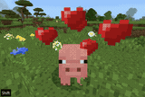
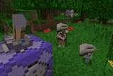

# BeatPet 🥺
[


](https://github.com/MineBuilders/BeatPet/releases/latest)
[![QQ Group](https://img.shields.io/badge/QQ_Group-Cdm's_group-0099ff?style=for-the-badge&logo=data%3Aimage%2Fpng%3Bbase64%2CiVBORw0KGgoAAAANSUhEUgAAAGAAAABgCAYAAADimHc4AAAACXBIWXMAACE4AAAhOAFFljFgAAAAAXNSR0IArs4c6QAAAARnQU1BAACxjwv8YQUAAARcSURBVHgB7Z2NUdswFMf%2F6XWAdALEBNAJaiZomQAzQekEJBOUTsAIzQawQekEdicgnUDVO8uHa0icSHqyJb%2Ffnc6Q5GxLT%2B9DlvwECIIgCIIgzJEFJo7WujCHc1PO7HFpiur9rDZla4%2B%2FTXky5XGxWGwhHA81uin3pjxrPx5MKU1ZQhjGNlalw1OZcmuKgvAa3fT4J81PZUoJ4QXTIN91fB703LXBNMDSNsRYVHoCQhglCrIVf8DraCY2FCVdmGjpCSMRXQC6iUh%2BYfzGbxlVCO8Qn3tMp%2FEJ6hA%2FxzJHUQVgKnlrDl8wPRSajpEv1MP09FkhMtF8gKlchWmZnl2cGn9QIxJRTJBuBj8KaRDVFEXRgIR6fwtFRY%2BIALsGJNb7W24RCXYNSLD3t0TRAlYNMI1PIadCmkQJl7lN0BRj%2FkO50hHmEdhMkL35Z6QNuxni1IAC6cOuwZwCSNn8tHwGM5wCOEP60OMTBUZYBGDt%2FznyoAAjXBqQS%2BMTrHURAQyjwAiXABTygdWXcQkgBwfcosAIlwCyWonGGQmJCToMtg4lGnAYyQkgNxSYCC4ALSuRj4JDA0QARxBcADFXFOSA%2BICR4fABCvmRVBRUIj%2FY5gWCT0kmvApiCJbpyaAakPgqiCFYZvhCm6AS%2BcKySiKYAKzzZZ9DHRFq%2FBKBCakBJfIneAcL5oQzdr59gjrjIBqQufPtE9QZhzJBJeZDUGfsLYAZON8%2BQZ1xCA0oMD%2BCdThvJzwj59vnQ4h0OF4aYBqf1v8ozJMbBMDXBAW5iUT5hAD4CiDITSQKpdgp4ImzAOzFFeZNAU98NCCH9f%2B%2BeFsAHwHM2fy0FL4zgE4CsBfNaQW0D16WwFUDCggtBTxwFYDY%2Fxe8TLGrAHJafu7L0g5InThaADMf%2Fe6igCMuGqAg9HG2CC4CGFK3GnmyL6lfPBM0cLE18hXAtz3fKTjiIoCTHZ%2FX5vHsyhz%2FID%2B2dh74x47vl64DspA%2B4MIe96lqqrR1WmG3hjtNU7oI4K0LrTvL0nMUAO1JADsBc4km2WufaALos7Gmp4UE4D1TNDE27R82w%2B4agXARQLdxa%2FSck%2B0lOWlB3V8HZP6%2Fw25%2FcBQ%2BAqjRLFKq3%2FhNsB4yAR7f%2BtDU%2B6b3XY0YUHZZfUD%2Bfc2zE8YYqD11pOjnTjcLE6aFbrYjSR32JK6saSt1%2BktW2NMYc7%2Bkd410Wcd44zNG4laKGL4iLSjyOUUEYgiABii0XUkqU5gU5X2M9b4z%2B3vCndFjjTS4zi59va0QPSuqMW2o8TfIFd3solHpaVJiBN4jErpZSXeF6SbzuDL3SMdNzE1AuccB1NgUAZVIZzxQo3nEsF6knHhEN%2FtDVjpt2DdyYNEAe%2BMr5AHtS3wBJjhyReSQtr7PJVd0xBWG1sgLNqfMZYIUmpFvgWYSv7sN%2BRL7I6Et%2Fq%2Fwtlf%2B4mX7cnTOe9I7t%2BqcY%2Bia6JyvPTcdaSpyI1nABEEQBEEQQvMP82DW%2Bu24kOQAAAAASUVORK5CYII%3D)](https://qm.qq.com/cgi-bin/qm/qr?k=Vcspr10ZnFcPd29hgPUgmxcBPsPni6pC&jump_from=webapi&authKey=uKMeRLS8aWCJwEXlYmkKeg1aBg4xmt/UbdXvEejPDOqCxhIKpqLK8Q+qG4ZFl0Nn)
> A Minecraft Bedrock Addon / Plugin that lets you pet any entity 🫳

## 🎮 How to Use



### Method 1: Sneak to Pet (Recommended)
Hold `Sneak (Shift)` + `Right-click` on any entity to pet them!

### Method 2: Execute Command



You can even pet yourself with no arguments~

```
/pet [target] [template] [animation]
```

## 💡 Inspiration

- **[PatPat](https://github.com/LopyMine/PatPat)** - Inspired the original petting idea, ported here for Bedrock Edition.
- **[petpet](https://github.com/Dituon/petpet)** - The original QQ bot plugin that generates meme images from various templates, including the iconic "petpet" template used here.

## 🎈 Open Source

This project is licensed under the GNU Affero General Public License v3.0 (AGPL-3.0).  
Please refer to the [LICENSE](./LICENSE) file for full details.

```
A Minecraft Bedrock Addon / Plugin that lets you pet any entity!
Copyright (C) 2026  Cdm2883

This program is free software: you can redistribute it and/or modify
it under the terms of the GNU Affero General Public License as published
by the Free Software Foundation, either version 3 of the License, or
(at your option) any later version.

This program is distributed in the hope that it will be useful,
but WITHOUT ANY WARRANTY; without even the implied warranty of
MERCHANTABILITY or FITNESS FOR A PARTICULAR PURPOSE.  See the
GNU Affero General Public License for more details.

You should have received a copy of the GNU Affero General Public License
along with this program.  If not, see <https://www.gnu.org/licenses/>.
```
